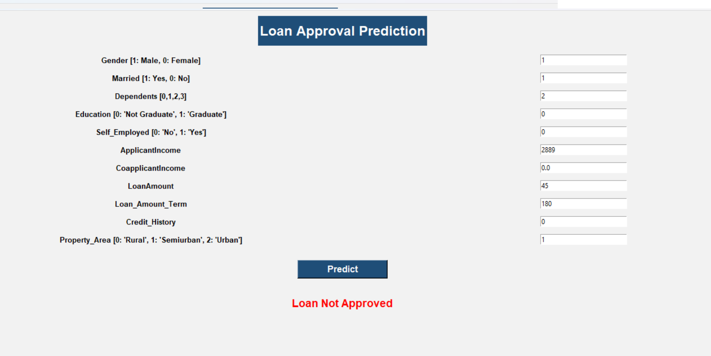

# Loan Approval Prediction 

## About

This is a Machine Learning project to predict whether a loan application will be **approved or not approved**.

I used the loan approval dataset and tried different classification algorithms to find a model that performs well on the given data. After comparing the models using testing accuracy and cross-validation, I selected **Logistic Regression** as the final model.

I also saved the trained model and used it in a simple **Tkinter application** for making predictions.

---

## Dataset

The dataset contains information about loan applicants such as:

* Gender
* Married
* Dependents
* Education
* Self Employed
* Applicant Income
* Coapplicant Income
* Loan Amount
* Loan Amount Term
* Credit History
* Property Area

The target variable is `Loan_Status`.

* `Y` → Loan Approved
* `N` → Loan Not Approved

The original dataset has **614 rows and 13 columns**.

---

## Data Preprocessing

Before training the models, I performed some basic data preprocessing.

* Checked the dataset information and shape
* Checked duplicate values
* Checked missing values
* Removed `Loan_ID`
* Removed rows with missing values in some important columns
* Filled missing values in `Self_Employed` and `Credit_History` using the mode
* Converted `3+` dependents into `3`
* Converted categorical values into numerical values
* Separated the features and target variable
* Used `train_test_split` with stratification
* Applied `StandardScaler` for models where scaling was required

After preprocessing, the dataset contained **553 rows and 11 input features**.

---

## Models I Tried

I trained and compared the following classification models:

* Logistic Regression
* K-Nearest Neighbors
* Decision Tree
* Random Forest
* Support Vector Classifier
* Gradient Boosting Classifier

I used **5-fold cross-validation** along with training and testing accuracy to compare the models.

---

## Model Comparison

| Model                   | Training Accuracy | Testing Accuracy | Cross-Validation |
| ----------------------- | ----------------: | ---------------: | ---------------: |
| **Logistic Regression** |            80.54% |       **81.98%** |       **80.30%** |
| K-Nearest Neighbors     |            81.00% |           81.08% |           77.57% |
| Decision Tree           |           100.00% |           69.37% |           71.24% |
| Random Forest           |           100.00% |           79.28% |           78.85% |
| SVC                     |            81.45% |           81.08% |           80.11% |
| Gradient Boosting       |            90.50% |           79.28% |           77.04% |

### Final Model

I selected **Logistic Regression** as the final model because it gave the highest cross-validation score among the models I tested and also performed well on the test data.

The Decision Tree and Random Forest models achieved 100% training accuracy, but their testing performance was lower. This shows that these models were fitting the training data too much compared to their performance on unseen data.

---

## Model Saving

After selecting Logistic Regression, I trained the final model on the complete processed dataset and saved it using Joblib.

```python
joblib.dump(Final_Model, 'Loan_Approval_Prediction_Model.pkl')
```

The saved model contains the complete pipeline:

```text
StandardScaler
      ↓
Logistic Regression
```

This saved model can then be loaded and used for new loan applications.

---

## Prediction

I tested the saved model with sample applicant information.

For example:

```text
Gender              = Male
Married             = Yes
Dependents          = 2
Education           = Not Graduate
Self Employed       = No
Applicant Income    = 2889
Coapplicant Income  = 0
Loan Amount         = 45
Loan Amount Term    = 180
Credit History      = 0
Property Area       = Semiurban
```

For this example, the model predicted:

**Loan Not Approved**

---

## Tkinter Application

I also created a simple Tkinter interface using the saved model.

The user can enter the applicant details and click on the **Predict** button. The application then displays either:

**Loan Approved** ✅

or

**Loan Not Approved** ❌

### Application Screenshot



---

## Technologies Used

* Python
* Pandas
* NumPy
* Scikit-learn
* Matplotlib
* Seaborn
* Joblib
* Tkinter
* Jupyter Notebook


